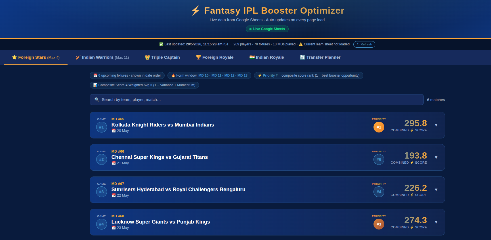
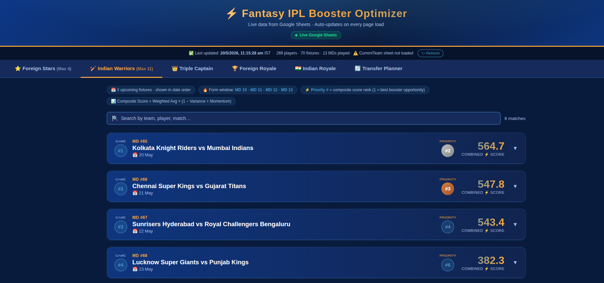
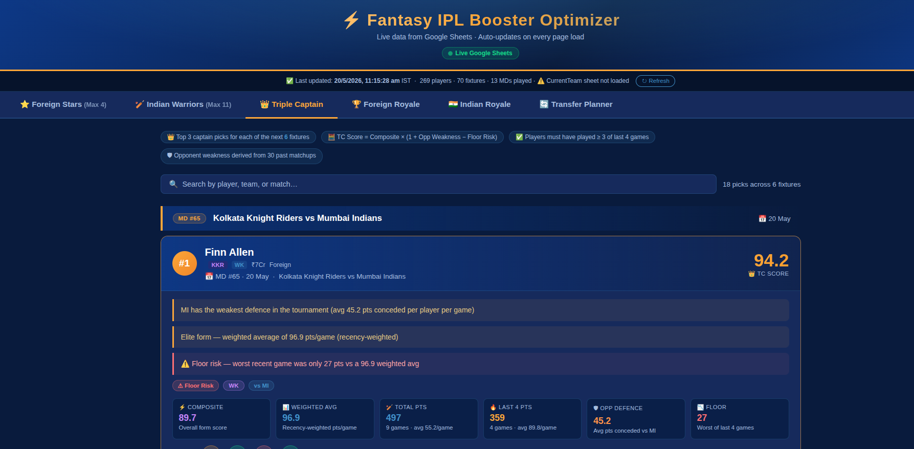
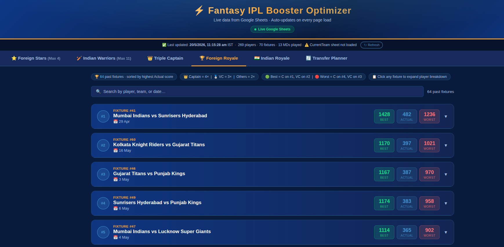
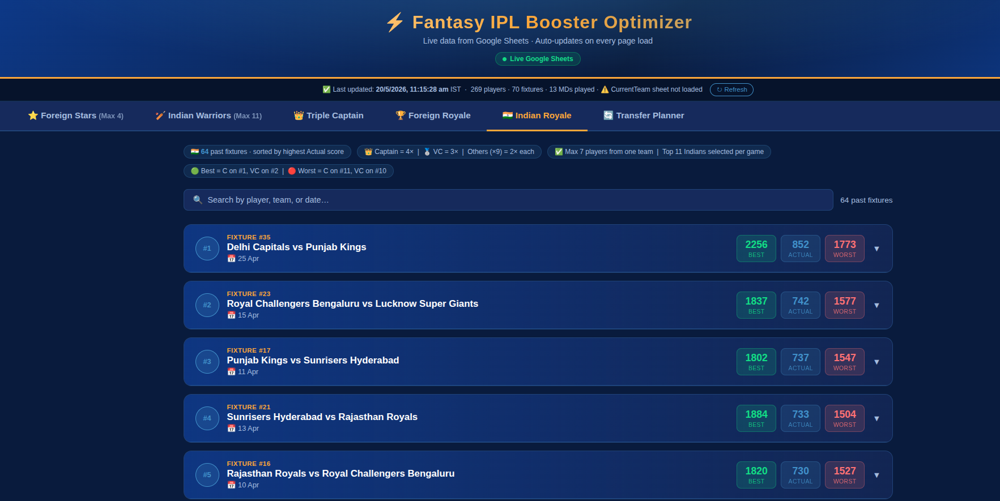

<div align="center">

# ⚡ Fantasy IPL Booster Optimizer

**Live data · Smart picks · Win your booster**

A personal dashboard for making optimal Fantasy IPL decisions — captain picks, player transfers, and booster selections — powered by live Google Sheets data and a custom composite scoring engine.



</div>

---

## What it does

Six tabs, each answering a specific fantasy decision:

| Tab | Question it answers |
|-----|-------------------|
| ⭐ **Foreign Stars** | Which 4 foreign players should I pick for my booster this game? |
| 🏏 **Indian Warriors** | Which 11 Indian players should I pick for my booster this game? |
| 👑 **Triple Captain** | Who should I captain for each upcoming fixture? |
| 🏆 **Foreign Royale** | Looking back, what was the best foreign booster XI for each past game? |
| 🇮🇳 **Indian Royale** | Looking back, what was the best Indian booster XI for each past game? |
| 🔄 **Transfer Planner** | Which players in my squad should I transfer out, and who should come in? |

Players are ranked using a **Composite Score** that combines weighted recent form, consistency, and momentum — not just raw averages. Only players who featured in **at least 3 of the last 4 match days** are eligible, filtering out injured or benched players automatically.

---

## Screenshots

<table>
  <tr>
    <td><strong>⭐ Foreign Stars</strong> — top 4 overseas picks per fixture, ranked by composite score</td>
    <td><strong>🏏 Indian Warriors</strong> — top 11 Indians per fixture</td>
  </tr>
  <tr>
    <td></td>
    <td></td>
  </tr>
  <tr>
    <td><strong>👑 Triple Captain</strong> — top 3 captain picks per fixture with detailed reasoning</td>
    <td><strong>🏆 Foreign Royale</strong> — retrospective best/worst booster scores per past game</td>
  </tr>
  <tr>
    <td></td>
    <td></td>
  </tr>
  <tr>
    <td><strong>🇮🇳 Indian Royale</strong> — same retrospective analysis for Indian players</td>
    <td></td>
  </tr>
  <tr>
    <td></td>
    <td></td>
  </tr>
</table>

---

## Scoring algorithms

### Composite Score
The core ranking metric used across all tabs:

```
Composite = WeightedRecentAvg × (1 − ConsistencyPenalty + MomentumBonus)
```

- **Weighted Recent Average** — last 4 scores, with oldest weighted 1× and most recent weighted 4×
- **Consistency Penalty** — coefficient of variation across last 4 scores, capped at −15%
- **Momentum Bonus** — linear regression slope over last 4 scores, capped at ±10%

### Triple Captain Score
```
TC Score = Composite × (1 + OpponentWeakness×0.20 − FloorPenalty)
```
Opponent weakness is derived from average fantasy points conceded per player across all past fixtures. Floor penalty (7–15%) is applied when a player's worst recent game is disproportionately low relative to their average.

### Transfer Planner — Effective Score
```
Effective Score = Composite × Urgency
```
Urgency multipliers: Today `1.3×` · Next game `1.1×` · +2 games `1.0×` · +3 games `0.85×` · +4 or more `0.7×`

Players playing today are prioritised; players sitting out for several cycles are flagged for transfer.

---

## Running locally

No install, no build step.

```bash
git clone https://github.com/your-username/fantasy-ipl-optimizer.git
cd fantasy-ipl-optimizer
python3 -m http.server 8080
```

Then open [http://localhost:8080](http://localhost:8080).

> A static file server is required because the app uses ES modules, which browsers block on `file://` URLs.

---

## Data source

All data is fetched live from a **Google Sheet** via a deployed Google Apps Script web app. The sheet has three tabs:

- **PlayerData** — one row per player with match-day scores (`MD 1` … `MD 14`), totals, and status (Foreign/Indian)
- **FixtureList** — upcoming and past fixtures with dates
- **CurrentTeam** — your current squad with a `Next Game` column indicating games until each player plays

The dashboard refreshes data on every page load and has a manual **↻ Refresh** button in the header.

---

## Tech

- Vanilla JS · Native ES modules · No framework · No build step
- CSS custom properties for theming
- Google Sheets + Google Apps Script as a live backend
